# Scoped API

# User Authentication & Management API


---

## Overview

This project is a secure and scalable **User Authentication and Management API** built using **FastAPI**. It provides RESTful endpoints for user registration, authentication, profile management, and administrative user operations with role-based access control.

The API leverages modern Python asynchronous features and JWT token-based security to deliver fast and secure user management functionality suitable for web and mobile applications.

---

## Features

- **User Registration:** Create new users with unique usernames and emails.
- **User Authentication:** Authenticate users with username and password.
- **JWT-based Authorization:** OAuth2 compatible access tokens with fine-grained scopes.
- **User Profile Management:** Retrieve and update personal profile data.
- **Admin Management:** Admin-only endpoints for listing and updating users.
- **Password Hashing:** Secure password storage using bcrypt.
- **Database Metrics:** Prometheus metrics for monitoring DB connection pool and transactions.
- **Async Database Access:** Fully asynchronous SQLAlchemy ORM with PostgreSQL.
- **Dependency Injection:** Leveraging FastAPI's dependency injection for clean architecture.

---

## Technologies Used

- **Python 3.10+**
- **FastAPI** — high-performance asynchronous web framework
- **SQLAlchemy (async)** — asynchronous ORM for PostgreSQL
- **PostgreSQL** — robust relational database
- **bcrypt** — secure password hashing
- **PyJWT** — JSON Web Token creation and validation
- **Pydantic** — data validation and parsing
- **Prometheus Client** — monitoring and metrics
- **Uvicorn** — ASGI server for running FastAPI apps

---

## Installation & Setup

1. **Clone the repository:**

   ```bash
   git clone https://github.com/valed-dm/scoped-api.git
   cd scoped-api
   ```

2. **Create and activate a virtual environment:**

    ```bash
       python -m venv venv
       source venv/bin/activate # linux/macOS
       venv\Scripts\activate # windows
    ```

3. **Install dependencies:**

    ```bash
    poetry install --no-root
    ```

4. **Configure environment variables:**

    ```bash
    cp .env.example .env # edit secrets
    ```

   - DATABASE_URL (PostgreSQL connection string)
   - SECRET_KEY (JWT signing secret)
   - ALGORITHM (e.g., HS256)
   - ACCESS_TOKEN_EXPIRE_MINUTES (token expiry duration)
   - Other app-specific settings as needed

5. **Run database migrations:**

    ```bash
    alembic upgrade head
    ```

6. **Start the server:**

    ```bash
     uvicorn app.main:app --reload --log-level debug
    ```

7. **Access API documentation:**

   - Swagger UI: http://localhost:8000/docs
   - Redoc: http://localhost:8000/redoc

## API Endpoints Reference

| Endpoint               | Method | Description                          | Authorization      |
|------------------------|--------|--------------------------------------|--------------------|
| `/register`            | POST   | Register a new user                  | Public             |
| `/token`               | POST   | Obtain JWT access token (login)      | Public             |
| `/users/me/`           | GET    | Get current user profile             | Authenticated user |
| `/users/me/update/`    | PUT    | Update current user's data           | Authenticated user |
| `/admin/users/`        | GET    | List all users (paginated)           | Admin only         |
| `/admin/users/{id}`    | PATCH  | Update any user's data               | Admin only         |
| `/admin/status/`       | GET    | Get system health status             | Admin only         |

### Key:
- **Public**: No authentication required
- **Authenticated user**: Requires valid JWT token
- **Admin only**: Requires admin privileges + valid JWT token

## Security & Authentication

| Security Feature              | Implementation Details                          |
|-------------------------------|-----------------------------------------------|
| **Password Hashing**          | bcrypt algorithm for secure storage           |
| **Authentication Flow**       | OAuth2 password flow with JWT tokens          |
| **Token Features**            | Includes scopes for fine-grained permissions  |
| **Endpoint Protection**       | FastAPI Dependency Injection + SecurityScopes |
| **Admin Route Enforcement**   | Additional scope requirements for admin-only endpoints |

### Key Characteristics:
- 🔒 All passwords are irreversibly hashed before storage
- 🔑 JWT tokens contain user identity and permission scopes
- 🛡️ Automatic token validation on protected routes
- 👮 Admin routes require both valid token and admin privileges
- ⏱️ Tokens have configurable expiration for enhanced security

## Monitoring & Metrics

| Component               | Monitoring Solution      | Benefits                          |
|-------------------------|--------------------------|-----------------------------------|
| Database connections    | Prometheus metrics       | Tracks pool usage and efficiency  |
| Transaction durations   | Prometheus metrics       | Enables performance optimization  |


## License

This project is licensed under the **MIT License** - see the [LICENSE](LICENSE) file for full details.

[](https://opensource.org/licenses/MIT)


### SCREENSHOTS:

[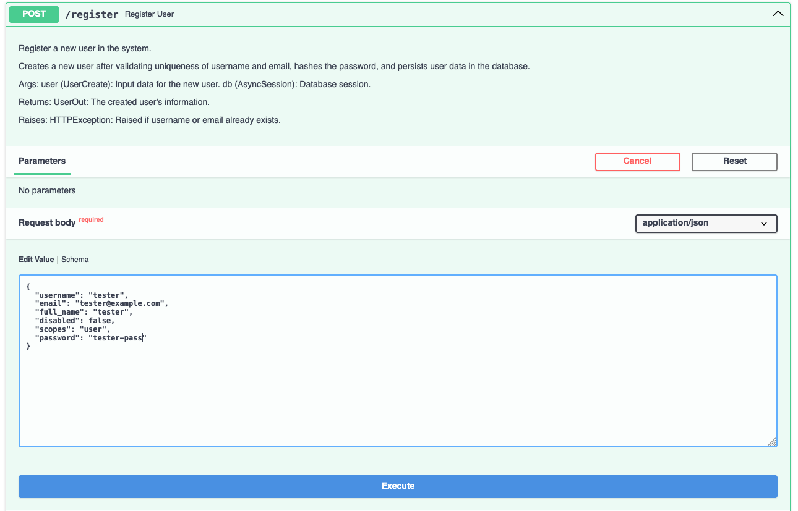]()

[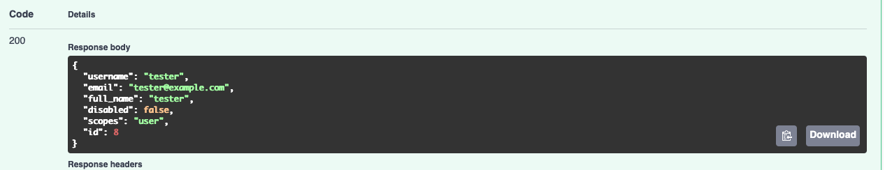]()

[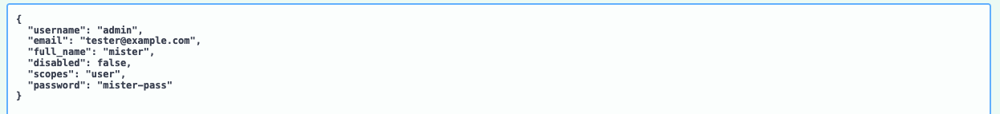]()

[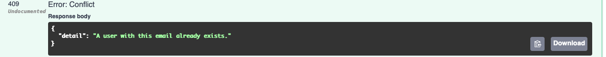]()

[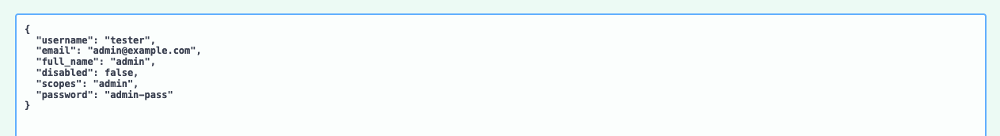]()

[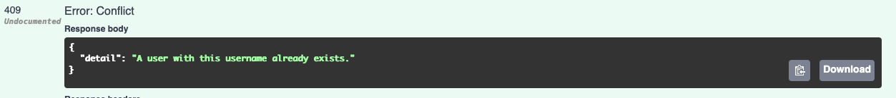]()

[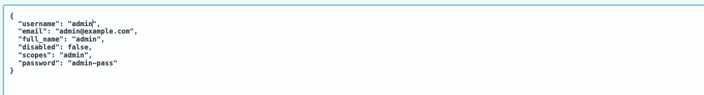]()

[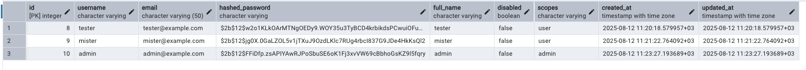]()

[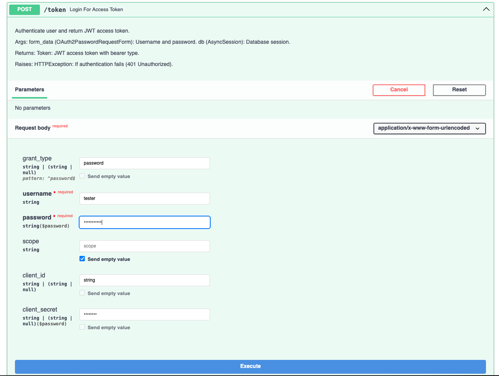]()

[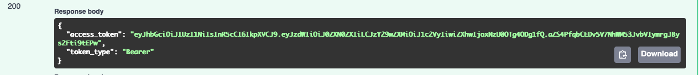]()

[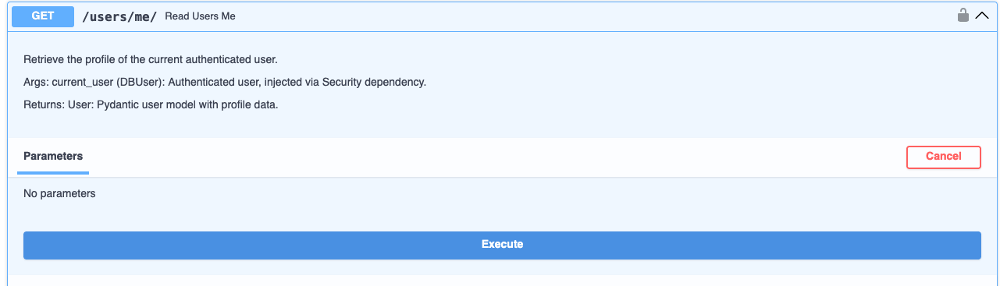]()

[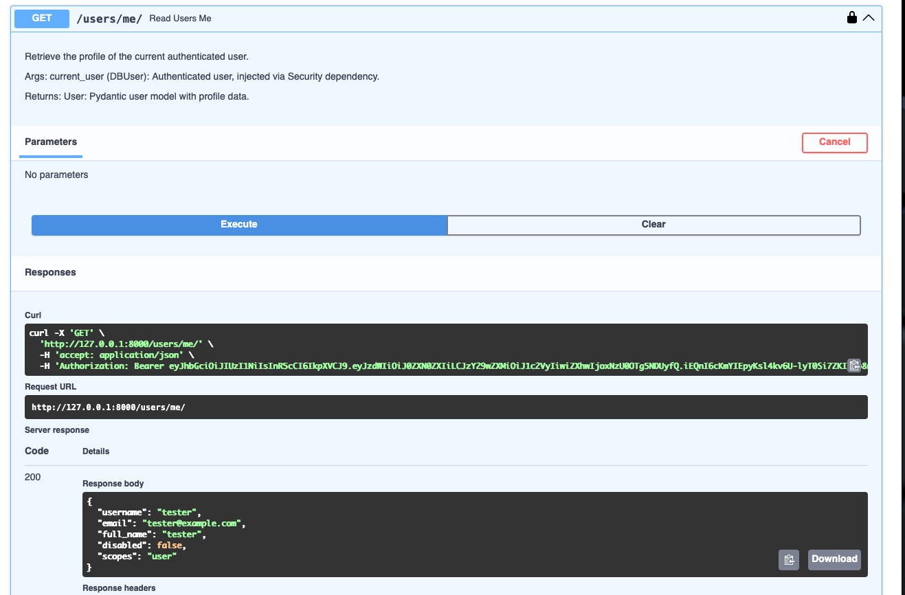]()

[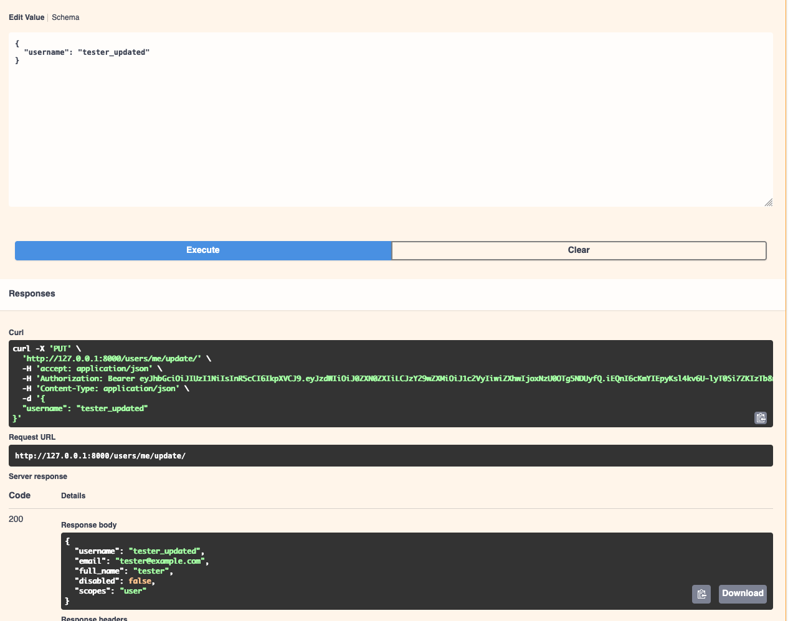]()

[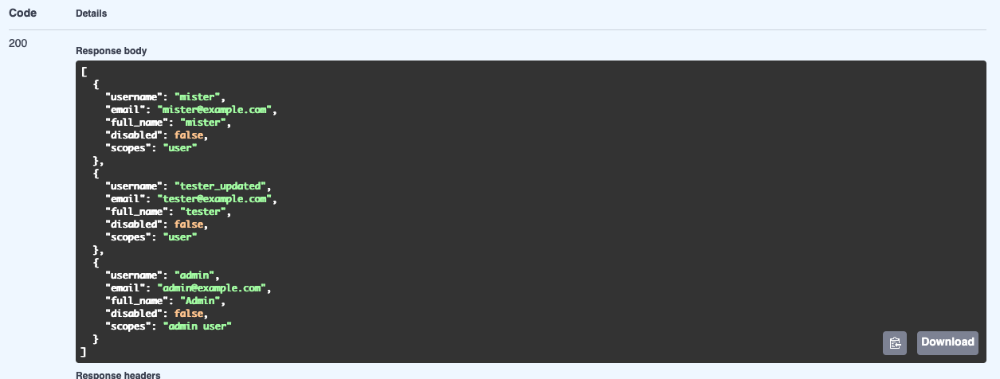]()

[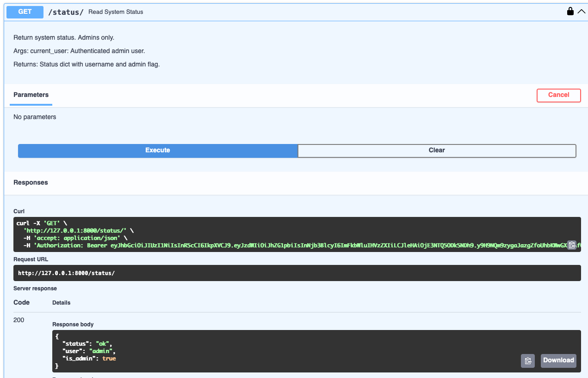]()

[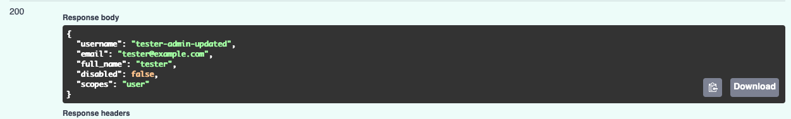]()
